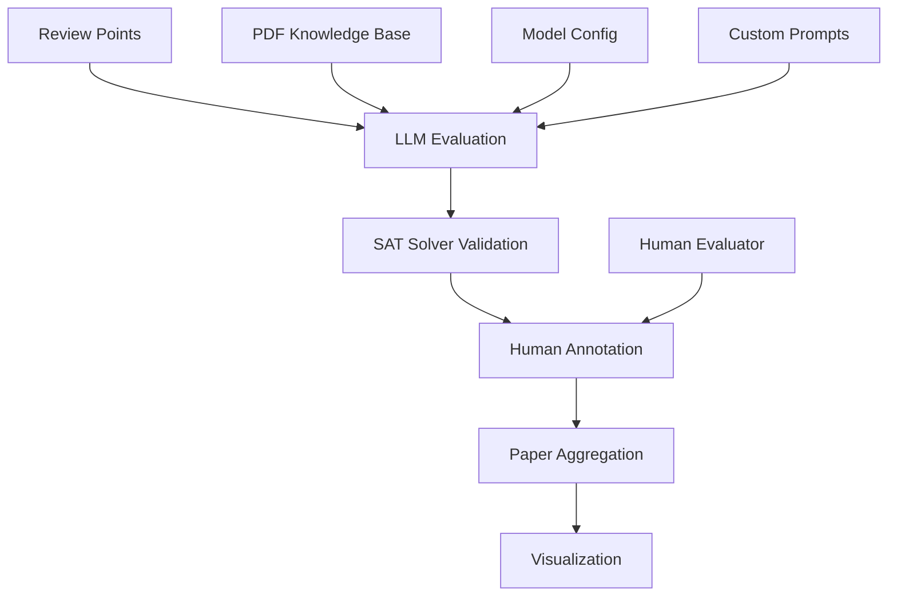
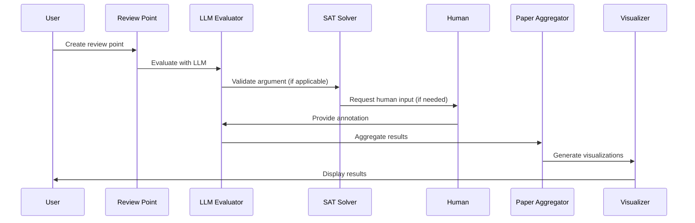

# Core Concepts Overview

Understanding the fundamental concepts behind ReviewScore.

## System Architecture

ReviewScore follows a modular architecture designed for flexibility and extensibility:



## Key Components

### 1. Review Points

The fundamental unit of evaluation in ReviewScore:

- **Questions**: Reviewer queries about the paper
- **Claims**: Reviewer statements about the paper
- **Arguments**: Reviewer reasoning with evidence

```python
from reviewscore import create_review_point, ReviewPointType

# Create different types of review points
question = create_review_point(
    text="What methodology was used?",
    point_type=ReviewPointType.QUESTION,
    paper_context="Paper content...",
    review_context="Review content...",
    point_id="q1"
)

claim = create_review_point(
    text="The experimental results are not convincing.",
    point_type=ReviewPointType.CLAIM,
    paper_context="Paper content...",
    review_context="Review content...",
    point_id="c1"
)

argument = create_review_point(
    text="The methodology is novel because it introduces attention mechanisms.",
    point_type=ReviewPointType.ARGUMENT,
    paper_context="Paper content...",
    review_context="Review content...",
    point_id="a1"
)
```

### 2. LLM Evaluation

Multiple language models evaluate review points:

- **OpenAI Models**: GPT-4o, GPT-3.5-turbo
- **Anthropic Models**: Claude-3.5-Sonnet, Claude-3-Haiku
- **Google Models**: Gemini-2.5-Flash, Gemini-1.5-Pro

```python
from reviewscore.model_evaluation import create_model_evaluation_system

# Create evaluator for different models
openai_evaluator = create_model_evaluation_system("gpt-4o")
anthropic_evaluator = create_model_evaluation_system("claude-3-5-sonnet-20241022")
google_evaluator = create_model_evaluation_system("gemini-2.5-flash")
```

### 3. SAT Solver Validation

Automated validation of argument consistency:

- **Z3 Solver**: Most powerful, handles complex arguments
- **PySAT Solver**: Fast, good for simple arguments
- **Simple Solver**: Fastest, basic validation

```python
from reviewscore.paper_faithful import PaperFaithfulConfig

# Configure SAT solver
config = PaperFaithfulConfig(
    sat_solver="z3",  # or "pysat" or "simple"
    enable_sat_validation=True
)
```

### 4. Human-in-the-Loop

Interactive workflows with human annotation:

- **LangGraph Agents**: State-based workflows
- **Checkpointing**: Save and resume evaluation state
- **Human Annotation**: Override AI decisions when needed

```python
from reviewscore.langgraph_agents import create_langgraph_agent

# Create agent with human-in-the-loop
agent = create_langgraph_agent(
    model_name="claude-3-5-sonnet-20241022",
    enable_human_in_loop=True
)
```

### 5. PDF Knowledge Base

Integration with PDF documents for context:

- **Single PDF**: Extract content from one document
- **Multi-PDF**: Combine multiple documents
- **Chunking**: Split documents into manageable pieces

```python
from reviewscore.pdf_knowledge_base import create_pdf_knowledge_base

# Create knowledge base from PDF
kb = create_pdf_knowledge_base("paper.pdf")

# Use in evaluation
config = PaperFaithfulConfig(
    knowledge_base=kb,
    enable_knowledge_base=True
)
```

## Evaluation Workflow

### 1. Review Point Creation

```python
# Create review point with context
review_point = create_review_point(
    text="The experimental results are not convincing.",
    point_type=ReviewPointType.CLAIM,
    paper_context="The paper presents experimental results on dataset X...",
    review_context="The reviewer claims the results are not convincing...",
    point_id="c1"
)
```

### 2. LLM Evaluation

```python
# Evaluate with LLM
result = evaluator.evaluate_review_point(review_point)

print(f"Base Score: {result.base_score}/5.0")
print(f"Advanced Score: {result.advanced_score}/5.0")
print(f"Misinformed: {result.is_misinformed}")
print(f"Confidence: {result.confidence}")
print(f"Reasoning: {result.reasoning}")
```

### 3. SAT Solver Validation

```python
# Validate argument consistency
if result.review_point.point_type == ReviewPointType.ARGUMENT:
    is_valid = sat_solver.validate_argument(result.review_point.text)
    print(f"Argument Valid: {is_valid}")
```

### 4. Human Annotation (Optional)

```python
# Request human input if needed
if result.confidence < 0.5:
    human_annotation = input("Please provide your annotation: ")
    result.human_annotation = human_annotation
```

### 5. Paper Aggregation

```python
from reviewscore.paper_review_result import create_paper_review_aggregator

# Aggregate individual results into paper-level analysis
aggregator = create_paper_review_aggregator()
paper_result = aggregator.aggregate_paper_review(
    paper_id="paper_123",
    review_point_results=results,
    paper_title="Research Paper Title"
)

print(f"Overall Quality: {paper_result.summary.overall_quality.value}")
print(f"Quality Score: {paper_result.summary.quality_score}/5.0")
print(f"Misinformed Rate: {paper_result.summary.misinformed_rate:.1%}")
```

## Scoring System

### Base Score (1-5)

- **5**: Excellent - High quality, well-reasoned
- **4**: Good - Solid quality with minor issues
- **3**: Moderate - Acceptable with some concerns
- **2**: Poor - Significant issues, needs improvement
- **1**: Very Poor - Major problems, unacceptable

### Advanced Score

Enhanced scoring that considers:
- Context relevance
- Evidence quality
- Reasoning depth
- Fairness and bias

### Misinformed Detection

Identifies when review points contain:
- Factual errors
- Misunderstandings
- Biased statements
- Inappropriate content

### Confidence Score

LLM confidence in its evaluation:
- **High (0.8-1.0)**: Very confident
- **Medium (0.5-0.8)**: Moderately confident
- **Low (0.0-0.5)**: Uncertain, may need human input

## Quality Levels

### Paper-Level Quality Assessment

- **Excellent**: High-quality review with minimal issues
- **Good**: Solid review with minor concerns
- **Moderate**: Acceptable review with some problems
- **Poor**: Significant issues, needs improvement
- **Very Poor**: Major problems, unacceptable quality

### Quality Score Calculation

```python
quality_score = (
    average_base_score * 0.4 +
    (1 - misinformed_rate) * 0.3 +
    confidence_score * 0.2 +
    consistency_score * 0.1
)
```

## Workflow Types

### 1. LCEL Workflows

Chain-based workflows using LangChain Expression Language:

```python
from reviewscore.lcel_workflows import create_lcel_workflow

workflow = create_lcel_workflow("claude-3-5-sonnet-20241022")
result = workflow.invoke({"review_point": question})
```

### 2. LangGraph Workflows

State-based workflows with conditional logic:

```python
from reviewscore.langgraph_flows import create_langgraph_flow

flow = create_langgraph_flow("claude-3-5-sonnet-20241022")
result = flow.invoke({"review_point": question})
```

### 3. LangChain Agents

ReAct-based agents with tools:

```python
from reviewscore.langchain_agents import create_langchain_agent

agent = create_langchain_agent("claude-3-5-sonnet-20241022")
result = agent.evaluate_review_point(question)
```

### 4. LangGraph Agents

State-based agents with human-in-the-loop:

```python
from reviewscore.langgraph_agents import create_langgraph_agent

agent = create_langgraph_agent(
    "claude-3-5-sonnet-20241022",
    enable_human_in_loop=True
)
result = agent.evaluate_review_point(question)
```

## Data Flow



## Best Practices

### 1. Review Point Creation

- Provide clear, specific text
- Include relevant paper context
- Add meaningful review context
- Use descriptive point IDs

### 2. Model Selection

- Use appropriate model for your accuracy needs
- Consider cost and speed requirements
- Test different models for your use case

### 3. SAT Solver Usage

- Use Z3 for complex arguments
- Use PySAT for simple arguments
- Use simple solver for speed

### 4. Human-in-the-Loop

- Enable for high-stakes evaluations
- Use appropriate confidence thresholds
- Provide clear human annotation interfaces

### 5. Knowledge Base Integration

- Use PDF knowledge bases for context
- Chunk documents appropriately
- Consider multiple document sources

## Next Steps

- **[Review Points](review-points.md)** - Learn about review point types and creation
- **[Evaluation Methods](evaluation-methods.md)** - Understand different evaluation approaches
- **[SAT Solver](sat-solver.md)** - Learn about argument validation
- **[Examples](examples/basic-usage.md)** - See concepts in action
