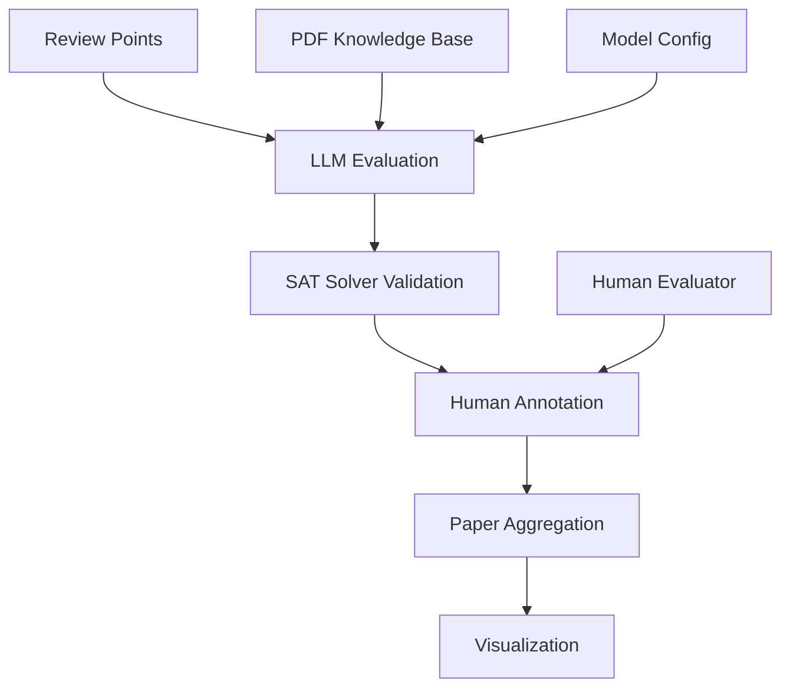

# ReviewScore Documentation

Welcome to the ReviewScore documentation! ReviewScore is a comprehensive system for evaluating the quality of academic paper reviews using advanced AI models, SAT solvers, and human-in-the-loop workflows.

## What is ReviewScore?

ReviewScore implements the methodology described in the paper "ReviewScore: A Comprehensive Framework for Evaluating Review Quality" (arXiv:2509.21679). It provides:

- **Multi-Model Evaluation**: Support for OpenAI, Anthropic, and Google models
- **SAT Solver Integration**: Argument validation using Z3, PySAT, or simple solvers
- **Human-in-the-Loop**: LangGraph-based workflows with human intervention
- **PDF Knowledge Base**: Integration with PDF documents for context
- **Comprehensive Visualization**: Rich plots and analytics for review analysis
- **Paper-Level Aggregation**: Overall quality assessment and recommendations

## Key Features

### 🧠 AI-Powered Evaluation

- Multiple LLM providers (OpenAI, Anthropic, Google)
- Configurable evaluation parameters
- Confidence scoring and reasoning

### 🔍 SAT Solver Validation

- Argument consistency checking
- Multiple solver backends (Z3, PySAT, simple)
- Automated validation workflows

### 👥 Human-in-the-Loop

- LangGraph-based agent workflows
- Interactive human annotation
- Checkpointing and resumption

### 📊 Rich Visualizations

- Score distribution analysis
- Model comparison charts
- Temporal analysis plots
- Paper-level summaries
- Multi-paper dashboards

### 📄 PDF Integration

- Multi-PDF knowledge bases
- Content extraction and chunking
- Context-aware evaluation

## Quick Start

```python
from reviewscore import create_review_point, ReviewPointType
from reviewscore.paper_faithful import create_paper_faithful_evaluator

# Create a review point
question = create_review_point(
    text="What methodology was used in this paper?",
    point_type=ReviewPointType.QUESTION,
    paper_context="This paper uses transformer architecture...",
    review_context="The reviewer asks about methodology...",
    point_id="q1"
)

# Create evaluator
evaluator = create_paper_faithful_evaluator()

# Evaluate the review point
result = evaluator.evaluate_review_point(question)
print(f"Score: {result.base_score}/5.0")
print(f"Misinformed: {result.is_misinformed}")
```

## Architecture Overview



## Documentation Structure

- **[Getting Started](getting-started/installation.md)**: Installation and setup
- **[Core Concepts](core-concepts/overview.md)**: Understanding the system
- **[API Reference](api-reference/core.md)**: Complete API documentation
- **[Workflows](workflows/lcel-workflows.md)**: Different workflow types
- **[Examples](examples/basic-usage.md)**: Practical usage examples
- **[Advanced Topics](advanced/human-in-the-loop.md)**: Advanced features

## Citation

If you use ReviewScore in your research, please cite:

```bibtex
@article{reviewscore2024,
  title={ReviewScore: A Comprehensive Framework for Evaluating Review Quality},
  author={[Authors]},
  journal={arXiv preprint arXiv:2509.21679},
  year={2024}
}
```

## License

This project is licensed under the MIT License - see the [LICENSE](LICENSE) file for details.

## Contributing

We welcome contributions! Please see our [Contributing Guide](contributing.md) for details.

## Support

- 📧 Email: ashhadahsan@gmail.com
- 🐛 Issues: [GitHub Issues](https://github.com/ashhadahsan/review-score/issues)
- 💬 Discussions: [GitHub Discussions](https://github.com/ashhadahsan/review-score/discussions)
